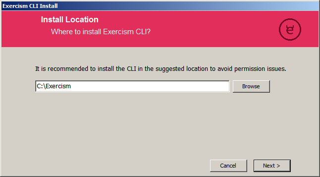
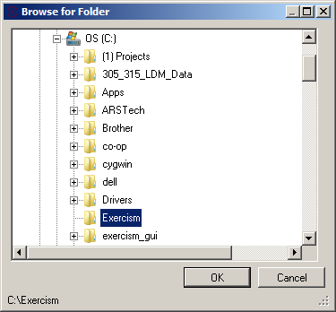
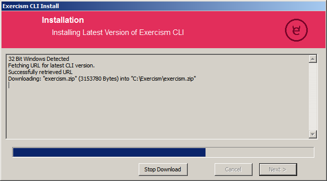
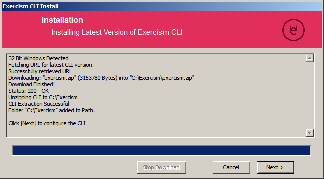
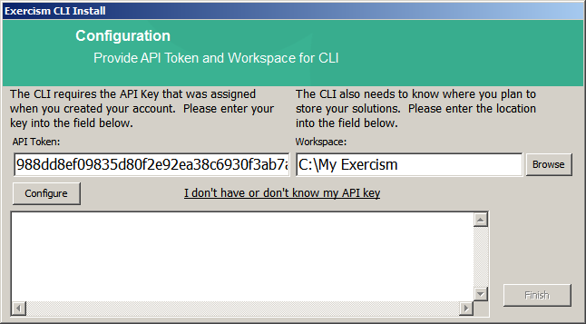
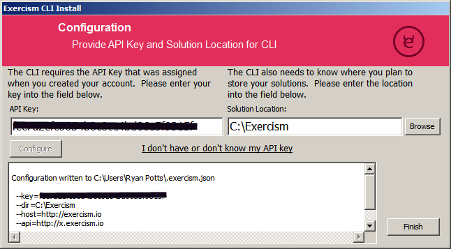

# Installer for the Exercism Windows Command-Line Client
A project to download and install the latest version of Exercism Client for Windows depending on the architecture.

© Copyright 2017 Exercism, Inc.  
All Rights Reserved  

Exercism Repository -> https://github.com/exercism/exercism.io

# System Requirements  
  *Supported Operating Systems* = Windows Vista, Windows 7, Windows 8/8.1 , Windows 10  
  *Architecture* = 32bit / 64bit  
  *Internet Connection* = Required to fetch the latest Exercism Binary  
  *Hard Disk* = 10MB for Client, 1KB for Configuration and some additional space to store the fetched exercises.  
    
    
    

# Step-By-Step Install Procedure    
## Install Location  
   
 `Browse` or type the location of the folder where you would like to install the Exercism CLI.  Click the `Next` button when ready to proceed.  
 
 You may use the `Browse` button to locate the folder in which to install the CLI.  
   
Click the `Ok` button to accept your folder selection.

## Download and Install  
   
 At this point the installer will proceed to download the latest version of the CLI for your OS architecture from the GitHub Repo for the Exercism CLI.  The downloaded ZIP file will automatically be unzipped into the folder you previously selected.  
   
 Click the `Next` button once the process completes successfully.  
 
## Configure CLI  
   
 The final step is to enter the Exercism api token which allows you to fetch, keep track of exercises, submit solutions etc.  This token is assigned to you when you initially sign up with Exercism.  Use the `I don't have or don't know my token` link to retrieve your token as needed.  
 Once you have input your token click the `Configure` button.  This will invoke the Exercism CLI which will be passed the token you just provided.  The output of the CLI will appear in the box at the bottom of the screen (I have blocked out my information).  
 
 
## Finished  
That's it. Click `Finish` and you are done!
   
  
  
Have fun with the exercises and keep learning!

## Contributing

If you want to help improve the installer, check out the [Contributing guide](CONTRIBUTING.md).
