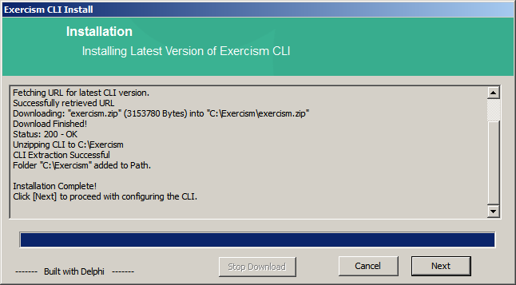

# Installer for the Exercism Windows Command-Line Client
A project to download and install the latest version of Exercism Client for Windows depending on the architecture.

© Copyright 2017 Exercism, Inc.  
All Rights Reserved  

Exercism Repository -> https://github.com/exercism/exercism.io

# System Requirements  
  *Supported Operating Systems* = Windows Vista, Windows 7, Windows 8/8.1 , Windows 10  
  *Architecture* = 32bit / 64bit  
  *Internet Connection* = Required to fetch the latest Exercism Binary  
  *Hard Disk* = 10MB for Client, 1KB for Configuration and some additional space to store the fetched exercises.  
    
    
    

# Step-By-Step Install Procedure    
## Install Location  
   
 `Browse` or type the location of the folder where you would like to install the Exercism CLI.  Click the `Next` button when ready to proceed.  
 
 
   
Click the `Ok` button to accept your folder selection.

## Download and Install  
 The installer will proceed to download the latest version of the CLI for your OS architecture from the GitHub Repo for the Exercism CLI.  The downloaded ZIP file will automatically be unzipped into the folder you selected.  
   
 Click the `Finish` button once the process completes successfully.  

Have fun with the exercises and keep learning!

## Contributing

If you want to help improve the installer, check out the [Contributing guide](CONTRIBUTING.md).
