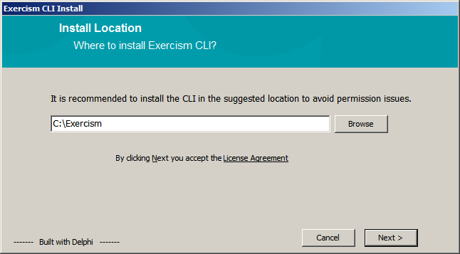
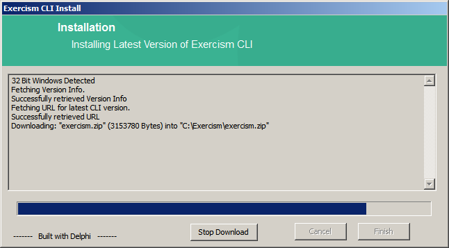
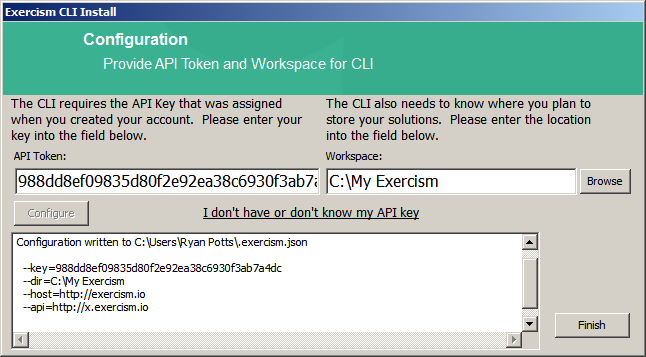

# Windows Installer for Exercism Windows CLI
A project to download and install the latest version of Exercism Client for Windows depending on the architecture.

Exercism is licensed under MIT License. Copyright (c) 2013 Mike Gehard, Katrina Owen

Exercism Repository -> https://github.com/exercism/exercism.io

# System Requirements  
  *Supported Operating Systems* = Windows Vista, Windows 7, Windows 8/8.1 , Windows 10  
  *Architecture* = 32bit / 64bit  
  *Internet Connection* = Required to fetch the latest Exercism Binary  
  *Hard Disk* = 10MB for Client, 1KB for Configuration and some additional space to store the fetched exercises.  
    
    
    

# Step-By-Step Install Procedure    
## License  
   
 This is the License Agreement form. To proceed with the installation accept the license agreement by clicking the `Next` button.  
 
## Install Location  
   
 Once you accept the agreement, you are presented with an Install Location screen. Browse or type the location of the folder where you would like to install the Exercism CLI.  Click the `Next` button when ready to proceed.  
 
 You may use the `Browse` button to locate the folder in which to install the CLI.  
   
Click the `Ok` button to accept your folder selection.

## Download and Install  
   
 At this point the installer will proceed to download the latest version of the CLI for your OS architecture from the GitHub Repo for the Exercism CLI.  The downloaded ZIP file will automatically be unzipped into the folder you previously selected.  
   
 Click the `Next` button once the process completes successfully.  
 
## Configure CLI  
   
 The final step is to enter the Exercism API key which allows you to fetch, keep track of exercises, submit solution etc.  This key is assigned to you when you initially sign up with Exercism.  Use the `I don't have or don't know my API key` link to retrieve your key as needed.  
 Once you have input your API key and have input a `Solution Location`, click the `Configure` button.  This will invoke the Exercism CLI which will be passed the information you just entered.  The output of the CLI will appear in the box at the bottom of the screen (I have blocked out my information).  
 
 
## Finished  
That's it. Click `Finish` and you are done!
   
  
  
Have fun with the exercises and keep learning!

[Contributing](CONTRIBUTING.md)

